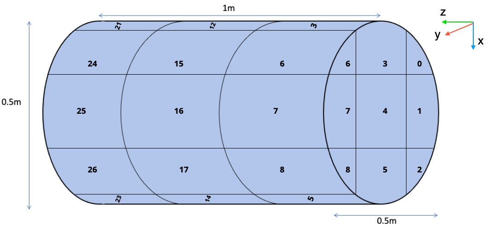

This repository contains code for self-supervised learning of track geometries from TPC [data](https://alphadavidson.slack.com/files/U0146JVGQEB/F025QCGNURJ/output_digi_hdf_mg22_ne20pp_8mev.h5) (in this case, Mg-22). Code is written in `python3` and uses the `tensorflow` package as the framework for the implementation.

# Packages
*Runs seamlessly using these versions as of July 12, 2023. Subject to change according to conda compatibility.*

* python 3.11.3
* tensorflow 2.12.0
* scikit-learn 1.2.2
* numpy 1.23.5
* click 8.0.4
* matplotlib 3.7.1
* tqdm 4.65.0
* jupyter 1.0.0
* seaborn 0.12.2
## Git Setup
After accessing server remotely by `ssh`, set up this Git repository for use. Enter your Git username and access token details as required.
* Cloning the repository: `git clone https://github.com/alpha-davidson/TPCNet.git`
* Creating your own branch: `git checkout -b [insert branchname here]`

## Setting up conda environment

`conda create -n tpcnet python=3.11.3`

## Installing packages

`conda activate tpcnet`

`conda install tensorflow=2.12.0 scikit-learn=1.2.2 numpy=1.23.5 click=8.0.4 matplotlib=3.7.1 tqdm=4.65.0 jupyter=1.0.0 seaborn=0.12.2`

*Ensure versions match those listed above under [Packages](#Packages). If any version is incompatible with conda due to updates, install default versions (ex. `conda install numpy click tqdm ...`) and **update README** accordingly.*

See workflow guide below to reproduce results.

# Explanation of Voxels

## Creating Voxel Data

Voxel datasets are compiled using the `Mg_22_Voxel_pipeline.ipynb` file. The data file from the TPC is first loaded, and points are randomly sampled (NOT a completely randomized process, however - random samples are taken according to the event length desired). Points with track labels of 2,4 and 6 are filtered out and only these data points are used in the voxelation process. In this stage, points are first normalized into a unit cube, segmented into voxels (K x K x K cube), and then assigned labels. Labeled voxels are then shuffled such that each voxel is assigned an ID other than its own. Points are then moved to their new voxel, and the current version of the notebook randomly augments points for better xyz generalization (although this is optional).It is then checked that the boundaries of the unit cube have not been violated. The file of shuffled voxels are split into training, testing and validation sets, which are saved in the `voxel_data` folder. Lastly, these datasets are checked for NaNs and infs, and a histogram is created.

## Voxel Orientation

Each voxel will be assigned an integer starting from 0 up to (K x K x K) - 1. Voxel number 0 has a bottom corner at the origin and the top, opposite corner at x = y = z = 1/K. The next voxel, voxel 1, has the same y and z coordinates as voxel 0 while the x coordinate moves forward. Below are examples of the voxel numbers if K = 3. The top picture is the front view, with the origin at the front, bottom right corner. The middle picture is the back view, with the origin being the back, bottom left corner. The bottom picture shows how these voxels are broken up on the actual ATTPC.

 

# Folders

In the repo's current version, there are 3 folders generated upon executing the main `Mg22_Voxel_pipeline.ipynb` notebook and the pretraining script `pretrain_on_jigsaw_events.py`.

* `models`: Folder containing model weights generated by running the `pretrain_on_jigsaw_events.py` script.
* `plots`: Folder containing learning curves generated by the `pretrain_on_jigsaw_events.py` script.
* `voxel_data`: Folder containing the training, validation and test files generated by the `Mg22_Voxel_pipeline.ipynb` notebook.

# Workflow to Reproduce Results
After setting up Git repo and conda environment.

## Running the Mg22 Voxel Pipeline Jupyter Notebook

Run the Mg22 Voxel Pipeline notebook. This will generate the `voxel_data` folder, which will contain training, test, and validation datasets for later use. Running the notebook will also generate histograms of the training, test and validation datasets post voxelization and shuffling.

## Training and evaluating pre-trained model

### Pretraining on Jigsaw

Pretraining is accomplished through the `pretrain_on_jigsaw_events.py` script, which can be submitted as a SLURM job  using the shell command `sbatch unscrambling_jigsaw.sh`. The `pretrain_on_jigsaw_events.py` script takes in the scrambled, voxelized  training and validation datasets from the `voxel_data` folder and unscrambles this data to generate event-wise predictions of original events. Running this script will output a model weights folder, located within `models` folder, as well as a loss curve that can be located at the `plots` folder. 

### Evaluating Reconstruction by Model

Evaluation of event reconstruction is accomplished by running the `evaluate_jigsaw_reconstruction.py` script, which can be submitted as a SLURM job using the shell command `sbatch evaluating_jigsaw.sh`. **Note, however, that you must adapt the contents of the file such that the models sub-folder reflects the correct (most recent) time stamp.** 

This script evalutes the quality of jigsaw reconstruction, invoking the `plotting.py` file to create 4 visualizations: 
* the original event voxelized, 
* the scrambling process,
* the reconstructed event, and 
* a proportion of hits to misses. 

These visualizations will be found in the `evaluations` subfolder in `plots`. Additionally, a point-wise mean accuracy metric can also be found in the `SLURM output file`.

The evaluating script will also plot a histogram of across all the events of the reconstructed accuracy, found in the `plots` folder. In other words, for each event, it will calculate the percentage of reconstructed points that match up with the original event and plot this in a histogram (percent accuracy histogram) form for all the events.

The `model_analysis.ipynb` Jupyter notebook contains functionality to analyze info relevant to the percent accuracy histogram. This is used to confirm observations and results are used to consider next steps for project improvement.

Lorraine.